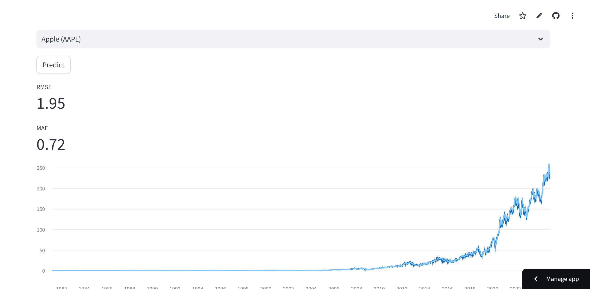

LSTM Stock Price Predictor

A simple deep learning application that predicts the next-day closing price of a stock using a Long Short-Term Memory (LSTM) neural network.

Live Demo: [Click here to view the app](https://lstm-stock-prediction-gcbwnkqb3pjvsuu6rfjhgx.streamlit.app/)
GitHub Repository: [View Code](https://github.com/Transacttt)


🚀 Features

1) Uses LSTM for time series forecasting.
2) Built with Python, TensorFlow/Keras, Pandas, NumPy, and Scikit-learn.
3) Interactive Streamlit dashboard to visualize actual vs. predicted prices.
4) Easily extendable to more stocks.


📊 Tech Stack
Backend / Modeling: Python, TensorFlow, Scikit-learn
Frontend: Streamlit
Data: Yahoo Finance + historical data (CSV)


📷 Screenshot




 🛠 How It Works

1. Load historical stock data from CSV.
2. Scale prices using MinMaxScaler.
3. Train an LSTM model on 60-day lookback windows.
4. Predict the next-day closing price.
5. Display RMSE and MAE performance metrics.


 📈 Example Output

RMSE: 2.53
MAE: 1.94


📦 Installation

```bash
# Clone the repository
git clone https://github.com/transacttt/lstm-stock-prediction.git
cd lstm-stock-prediction

# Create virtual environment
python -m venv env
# Activate: Windows
env\Scripts\activate
# Activate: Mac/Linux
source env/bin/activate

# Install dependencies
pip install -r requirements.txt

# Run the app
streamlit run app.py
```


📌 Future POSSIBLE Improvements 

1) Add more stock tickers to dropdown.
2)Implement rolling forecast (multi-day prediction).
3) Deploy with CI/CD pipeline for automated updates.


